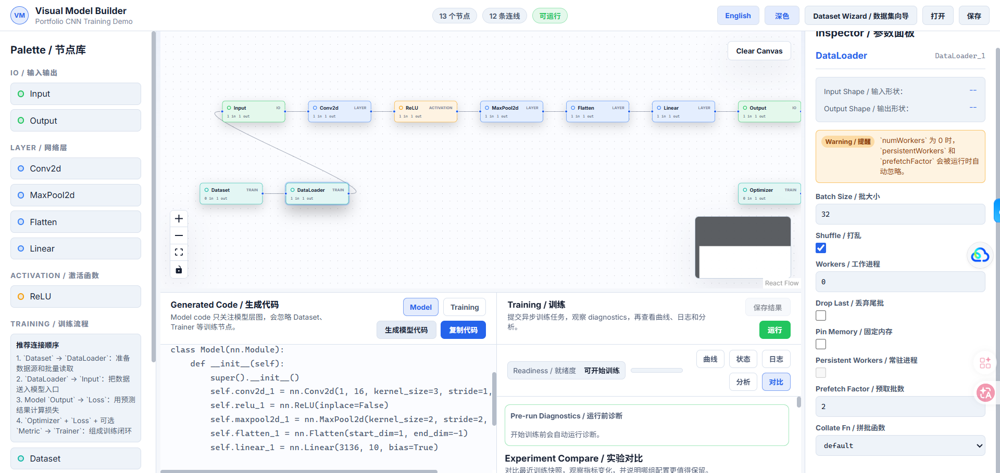

# Visual Model Builder

Visual Model Builder is a full-stack visual machine learning workbench for
building CNN training pipelines with drag-and-drop nodes, validating graph
structure, generating PyTorch code, inspecting datasets, and running training
jobs.



## Highlights

- Visual graph editor built with React, TypeScript, Vite, and React Flow.
- FastAPI backend with graph validation, shape inference, and PyTorch codegen.
- Dataset inspection for built-in, image folder, and CSV-style workflows.
- Async training jobs with progress polling, logs, diagnostics, and reports.
- Experiment comparison with saved training summaries.

## Quick Start

Start the backend:

```powershell
cd "visual-model-builder/backend"
python -m uvicorn app.main:app --host 127.0.0.1 --port 8000
```

Start the frontend:

```powershell
cd "visual-model-builder/frontend"
npm install
npm run dev -- --host 127.0.0.1 --port 5173
```

Open the app:

- Frontend: http://127.0.0.1:5173
- API docs: http://127.0.0.1:8000/docs
- Health check: http://127.0.0.1:8000/health

More project details are available in
[visual-model-builder/README.md](visual-model-builder/README.md).
