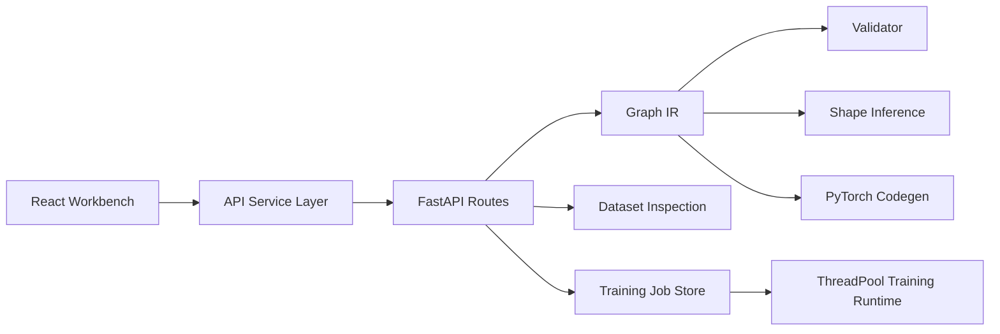

# Visual Model Builder

Visual Model Builder 是一个面向机器学习学习者和作品集展示的可视化建模工作台。用户可以通过拖拽节点搭建神经网络、查看张量 shape 推导、生成 PyTorch 代码，并把 Dataset、DataLoader、Loss、Optimizer、Trainer、Metric 串成可运行的训练流程。

项目定位是“产品级 ML 可视化工具 demo”：前端强调专业工作台质感，后端提供结构化校验、代码生成、数据集 inspection 和任务式训练 API，适合作为简历项目展示工程完整度。

## Portfolio Highlights

- 可视化建模：基于 React Flow 的节点画布，支持模型节点、数据节点和训练节点混合编排。
- Shape inference：后端按拓扑顺序推导每个节点的输入/输出 shape，并把错误映射回节点。
- PyTorch codegen：从可视化图生成可读的模型代码和训练脚本。
- Dataset inspection：支持 builtin、image_folder 和 csv 扩展入口，返回样本数、类别、split、input shape、warnings/errors。
- 任务式训练：新增 `/training-jobs` 生命周期接口，支持 queued/running/completed/failed/cancelled、进度轮询、日志和最佳努力取消。
- 双主题 UI：深色/浅色主题使用 CSS 变量管理，并通过 localStorage 持久化。
- 训练反馈：训练面板展示 readiness、diagnostics、loss/accuracy 曲线、运行日志、分析建议和 HTML 报告导出。
- 实验评估与可复现：训练后持久化 seed、config hash、project snapshot、runtime environment、验证集指标、confusion matrix、per-class precision/recall/F1，并提供后端 run history API。

## Tech Stack

Frontend:

- React + TypeScript + Vite
- Zustand 状态管理
- React Flow 画布
- CSS variables 主题系统

Backend:

- Python 3.11 + FastAPI
- Pydantic v2
- PyTorch / Torchvision runtime
- pytest 测试
- 单进程 in-memory training job store

## Architecture



## Project Structure

```text
visual-model-builder/
  frontend/
    src/
      features/
        canvas/
        palette/
        inspector/
        codegen/
        training/
      hooks/
      registry/
      services/
      store/
      types/
  backend/
    app/
      api/
      schemas/
      services/
        graph_ir/
        validator/
        shape_infer/
        codegen/
        training_jobs.py
        training.py
      tests/
```

## Quick Start

Start backend:

```bash
cd backend
python -m uvicorn app.main:app --reload --host 127.0.0.1 --port 8000
```

Start frontend:

```bash
cd frontend
npm install
npm run dev
```

Open:

- Frontend: http://127.0.0.1:5173
- API docs: http://127.0.0.1:8000/docs
- Health: http://127.0.0.1:8000/health

## API

Compatibility endpoints:

| Method | Path | Purpose |
| --- | --- | --- |
| GET | `/health` | Health check |
| POST | `/validate-graph` | Validate graph structure |
| POST | `/infer-shapes` | Infer node tensor shapes |
| POST | `/generate-code` | Generate PyTorch model code |
| POST | `/validate-training-graph` | Validate runnable training graph |
| POST | `/generate-training-code` | Generate training script |
| POST | `/diagnose-training-graph` | Return diagnostics and teaching insights |
| POST | `/inspect-dataset` | Inspect dataset configuration |
| POST | `/run-training` | Synchronous compatibility training run |

Training job endpoints:

| Method | Path | Purpose |
| --- | --- | --- |
| POST | `/training-jobs` | Create an async training job |
| GET | `/training-jobs/{jobId}` | Poll status, progress, logs, diagnostics, insights and metadata |
| POST | `/training-jobs/{jobId}/cancel` | Request best-effort cancellation |
| GET | `/training-runs` | List persisted training runs from saved summaries |
| GET | `/training-runs/{runId}` | Load one persisted training summary |

## Testing

Frontend:

```bash
cd frontend
npm run lint
npm run build
```

Backend:

```bash
cd backend
python -m pytest app/tests -q
```

## Resume Description

Visual Model Builder: built a full-stack machine learning visual workbench with React, React Flow, Zustand, FastAPI and PyTorch. Implemented graph validation, tensor shape inference, PyTorch code generation, dataset inspection, asynchronous training jobs with progress polling/cancellation, and a polished dual-theme product UI.

## Roadmap

- Add custom reusable subgraph modules.
- Expand model families beyond CNN blocks.
- Add regression metrics and CSV runtime training.
- Support CSV runtime training and regression workflows.
